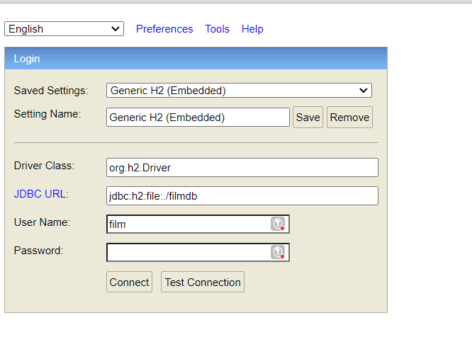
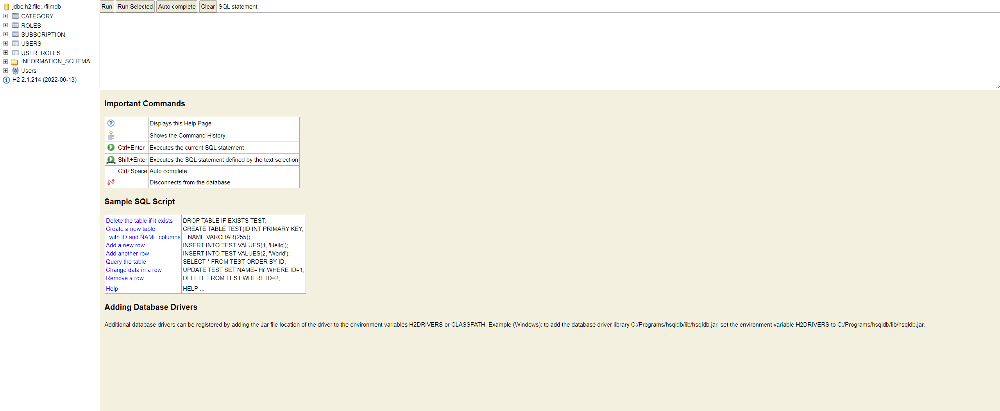
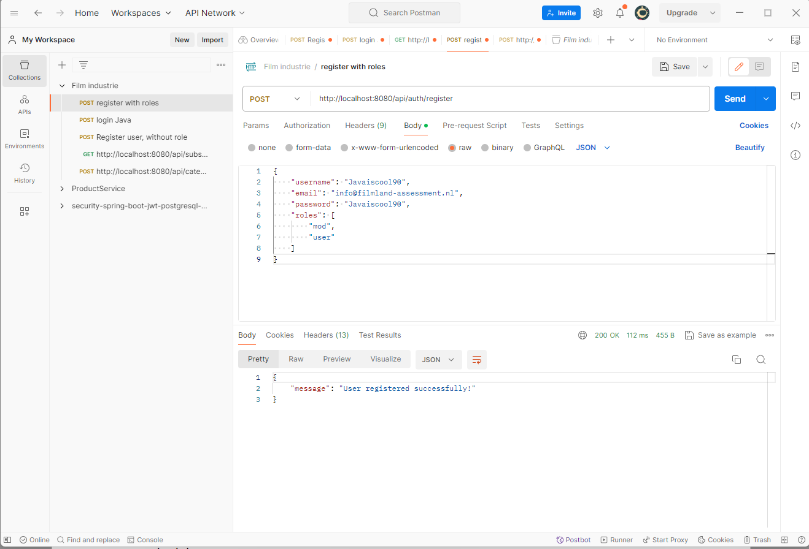

# Filmland Movies and Series app with Spring boot.

Auther: Jordy Hamwijk

## 1. Installation Prerequisites
* [Maven](https://maven.apache.org/download.cgi) 
* [Java 21](https://adoptium.net/temurin/releases/) 
* IDE(Of your own choice)
* Spring boot 2.7.16, Javax Validation
* Jwt 0.11.3
* Database H2 in memory

## 2. Project Installation

Open a new command line on

```git clone https://github.com/darksos34/spring-boot-filmland.git```

Build the project using Maven command line:

```mvn clean install```

Ruin the spring booot application:

```mvn spring-boot:run```

## 3. Setup H2 Database
Go to your favorite browser and typ in ````http://localhost:8080/h2-ui````

1. Pres Connect, leave fields default.

2. connect to the database

## 4. API Endpoints
To avoid as much manual work as possible, a Postman collection is provided for you to import within your Postman installation.
This file can be found in src/main/resources/import/postman_collection.json

